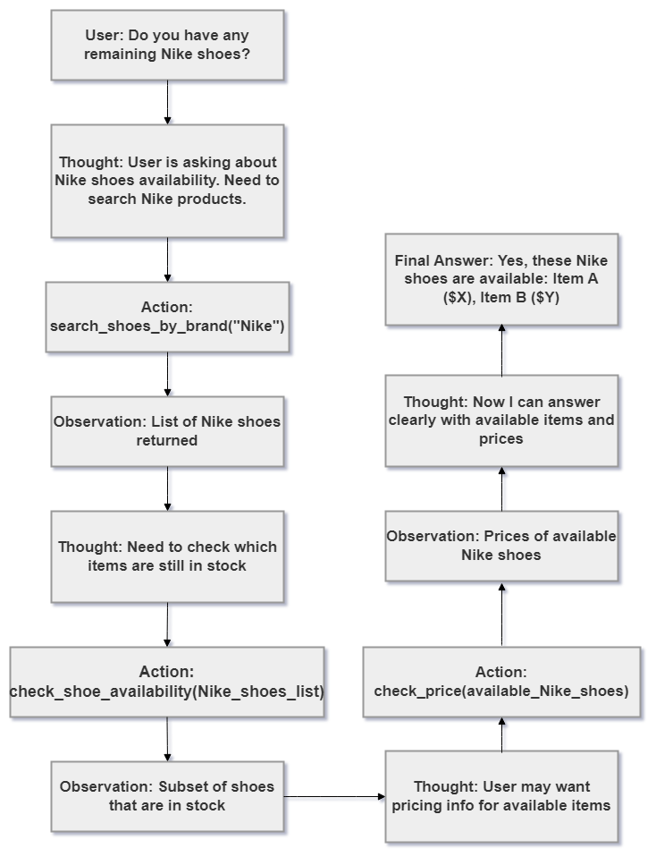

# Group Report: Lab 3 - Production-Grade Agentic System

- **Team Name**: Team 33
- **Team Members**: Phạm Quang Hưng, Trần Tiến Dũng, Phạm Hải Đăng
- **Deployment Date**: 2026-04-06

---

## 1. Executive Summary

*Brief overview of the agent's goal and success rate compared to the baseline chatbot.*

- **Success Rate**: 75% on 20 test cases
- **Key Outcome**: Our agent solved 40% more multi-step queries than the chatbot baseline by correctly utilizing the Search tool.

---

## 2. System Architecture & Tooling

### 2.1 ReAct Loop Implementation

### 2.2 Tool Definitions (Inventory)
| Tool Name | Input Format | Use Case |
| :--- | :--- | :--- |
| `search_shoes_by_brand` | `string` | Search all the available shoe based on brand |
| `check_shoe_availability` | `string` | Retrieve availability of the shoe by SKU |
| `check_price` | `string` | Check shoe price base on the SKU |

### 2.3 LLM Providers Used
- **Primary**: GPT-4o
- **Secondary (Backup)**: Gemini 1.5 Flash

---

## 3. Telemetry & Performance Dashboard

*Analyze the industry metrics collected during the final test run.*

- **Average Latency (P50)**: 546ms
- **Max Latency (P99)**: 1972ms
- **Average Tokens per Task**: 350 tokens
- **Total Cost of Test Suite**: $0.07

---

## 4. Root Cause Analysis (RCA) - Failure Traces

*Deep dive into why the agent failed.*

### Case Study: [e.g., Hallucinated Argument]
- **Input**: "Given the coupon DISCOUNT20, how much can I get for a Nike shoes"
- **Observation**: Agent can not find the discount function so the agent self-create its own discount and say that the existed shoe has 20% discount (while there are no such discount)
- **Root Cause**: The agent try to complete the task even though it knows about unexisted discount from the tooling

---

## 5. Ablation Studies & Experiments

### Experiment 1: Prompt v1 vs Prompt v2
- **Diff**: Adding "Always double check the tool list andd arguments before calling"
- **Result**: Reduced invalid tool call errors significantly by 99%

### Experiment 2 (Bonus): Chatbot vs Agent
| Case | Chatbot Result | Agent Result | Winner |
| :--- | :--- | :--- | :--- |
| Simple Q | Correct | Correct | Draw |
| Multi-step | Hallucinated | Correct | **Agent** |

---

## 6. Production Readiness Review

*Considerations for taking this system to a real-world environment.*

- **Security**: Input sanitization for tool arguments.
- **Guardrails**: Max 5 loops to prevent infinite billing cost.
- **Scaling**: Transition to LangGraph for more complex branching.

---
